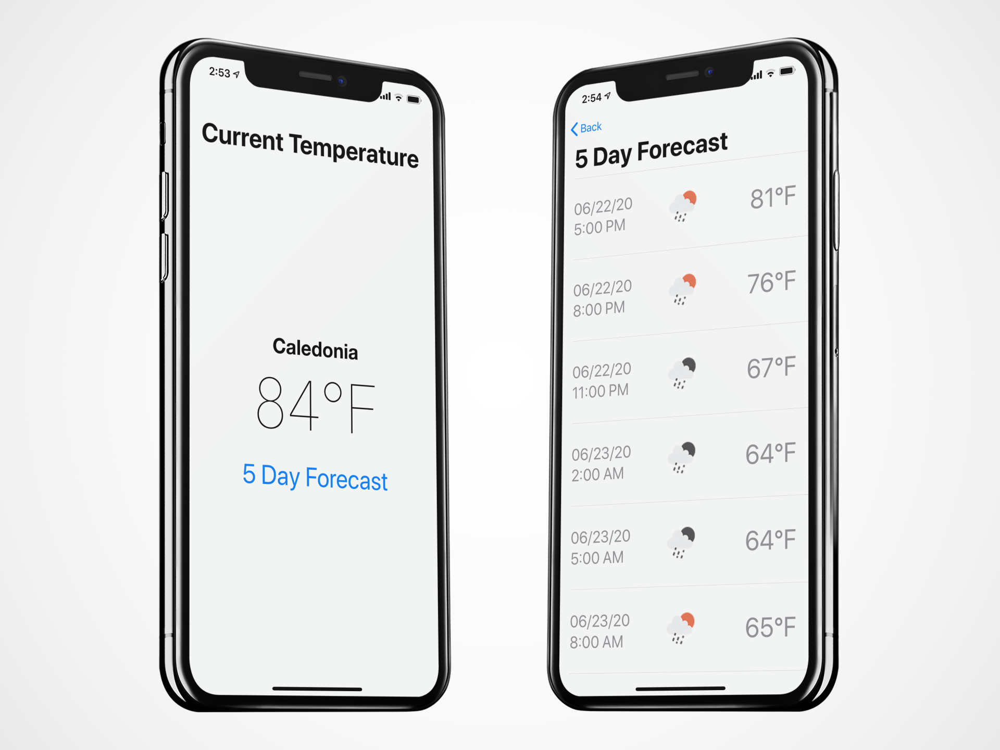

# WeatherApp



Demonstration of a simple iOS app that shows the weather for the current location

### Notes
This App follows the MVVM pattern using Combine (new to iOS 13); however, it still uses UIKit.
The idea is that the same ViewModels could be used with SwiftUI, but this was not attempted. 

- No 3rd party frameworks
- Handels the various edge cases with location
- Uses NSCache to cache weather images
- Logic is unit tested including services via mocking out URLSession during a test run
- Does not GCD, or (NS)Operation directly, relies on Combine 
- Follows current desgin trends including darkmode
- Logging via os.log
- Navigate to settings if permissions have not been granted

### Reactive Programming
I haven't been much of a fan of reactive programming (RxSwift) due to the impact on the architecture.
With the introduction of the Apple Combine Framework, I've used it more since it's part of iOS. 

*More info on Combine:*
https://heckj.github.io/swiftui-notes/


### Unit Testing

```
Executed 24 tests, with 0 failures (0 unexpected) in 0.128 (0.140) seconds
```
